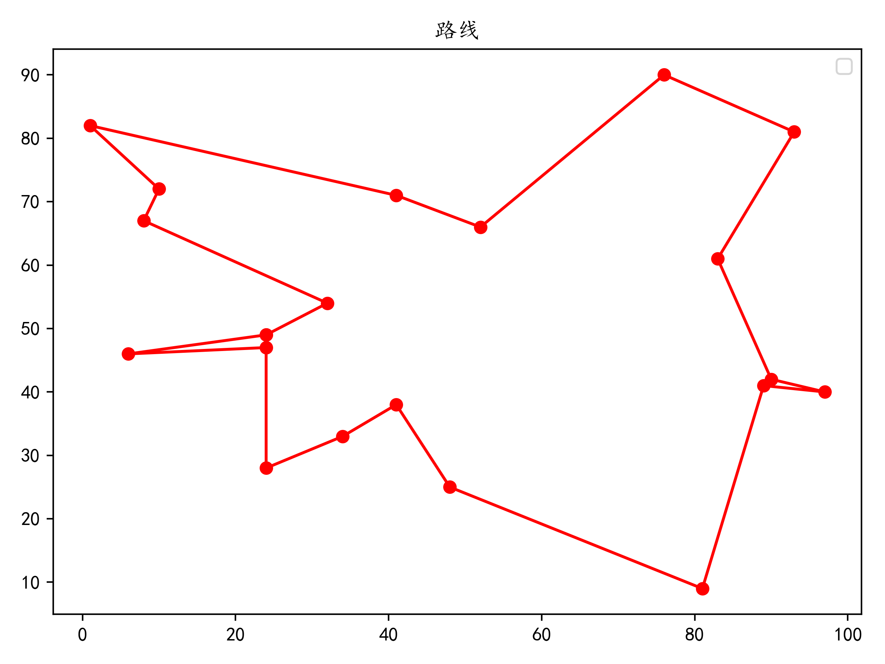
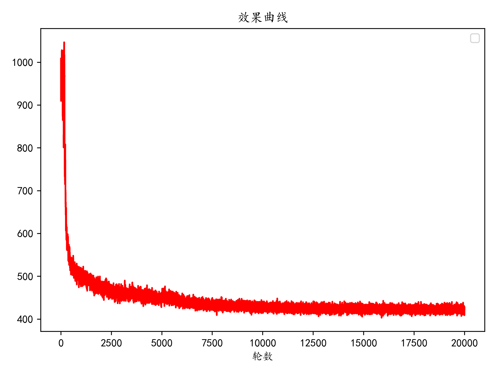

# 遗传算法解决旅行商（TSP）问题
## 视频地址
<https://www.bilibili.com/video/BV1FV41177dR>
## 效果
#### 运行效果

#### 训练过程

## 代码结构
```
actor.py：指针网络建立、训练过程
config.py：各参数配置
critic.py：评论家网络
dataset.py：生成训练样本
decoder.py：解码器解码过程
main.py：程序入口、结果展示
```
## 环境
* 语言：`python 3.7`
* 框架：`tensorflow-gpu 1.0.0`
* 数据处理：`numpy`
* 数据可视化：`matplotlib`
* 进度条工具：`tqdm`
## 使用
1. clone到本地
2. 准备环境
3. 运行main.py